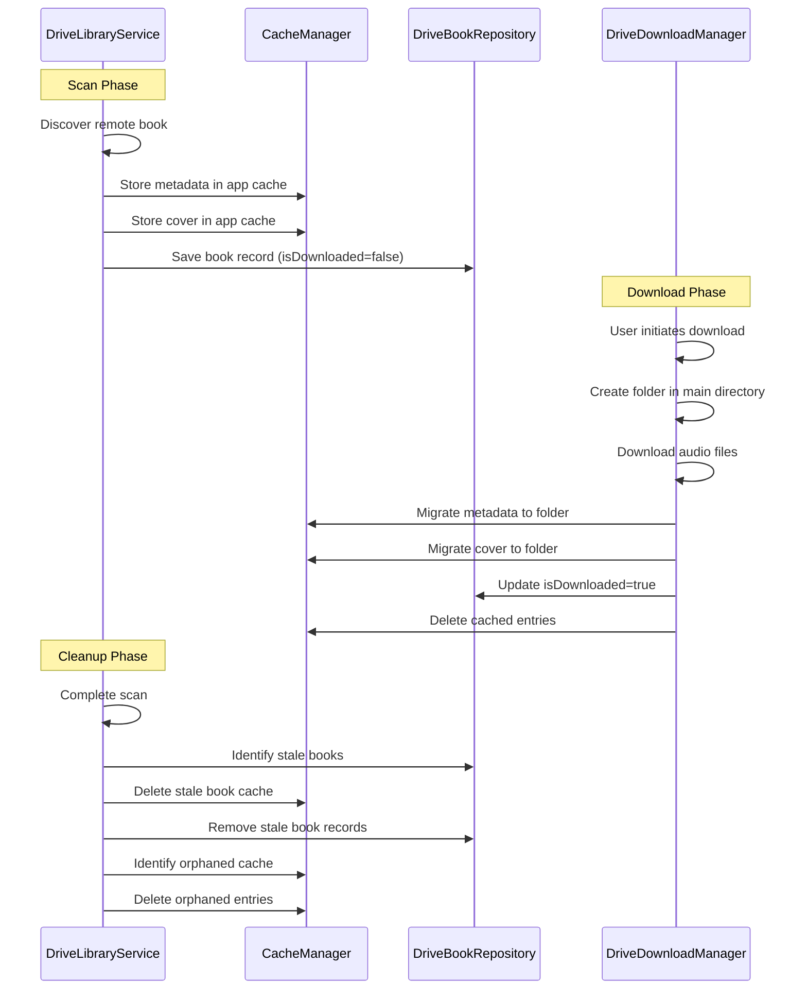

# Design Document: Google Drive Folder Management

## Overview

This design addresses folder creation timing, metadata caching, and cleanup operations for Google Drive audiobooks in AudioVault. The current implementation creates folders prematurely during scanning (line 126 in `drive_library_service.dart`), stores all metadata in the SQLite database, and lacks cleanup mechanisms for stale or orphaned data.

The enhanced system will:
- Defer folder creation until download time
- Cache metadata and covers in app storage for remote-only books
- Migrate cached data to the main audiobook directory upon download
- Clean up stale books and orphaned cache entries during scans
- Preserve existing downloaded books during migration

### Key Design Decisions

**Folder Creation Timing**: Move folder creation from `rescanDrive()` to `startDownload()` to prevent empty folders for undownloaded books.

**Metadata Storage Strategy**: Use a two-tier approach:
- Remote books: metadata and covers in app cache directory (`getApplicationCacheDirectory()`)
- Downloaded books: metadata and covers in the main audiobook directory alongside audio files

**Cache Organization**: Use folder ID as the cache key to prevent collisions and enable efficient lookup.

**Migration Safety**: Detect existing folders during initialization and mark corresponding books as downloaded to preserve user data.

## Architecture

### Component Responsibilities

**DriveLibraryService** (Modified)
- Remove folder creation from `rescanDrive()`
- Add folder creation to `startDownload()`
- Implement stale book detection and removal
- Coordinate cache migration during download

**CacheManager** (New Component)
- Store and retrieve metadata for remote books
- Store and retrieve cover images for remote books
- Migrate cached data to audiobook folders
- Identify and delete orphaned cache entries
- Organize cache by folder ID

**DriveBookRepository** (Modified)
- Add `isDownloaded` flag to track download status
- Add queries for stale book detection
- Support cache cleanup operations

**DriveDownloadManager** (Modified)
- Trigger cache migration after successful download
- Ensure folder exists before storing files

### Data Flow



## Components and Interfaces

### CacheManager

```dart
class CacheManager {
  /// Returns the cache directory for a specific folder ID
  Future<Directory> _cacheDir(String folderId);
  
  /// Stores metadata JSON for a remote book
  Future<void> storeMetadata(String folderId, Map<String, dynamic> metadata);
  
  /// Retrieves metadata for a remote book
  Future<Map<String, dynamic>?> getMetadata(String folderId);
  
  /// Stores cover image for a remote book
  Future<void> storeCover(String folderId, List<int> imageBytes);
  
  /// Retrieves cover path for a remote book
  Future<String?> getCoverPath(String folderId);
  
  /// Migrates metadata and cover from cache to audiobook folder
  Future<void> migrateToFolder(String folderId, String destDir);
  
  /// Deletes all cached data for a folder ID
  Future<void> deleteCachedData(String folderId);
  
  /// Identifies orphaned cache entries not in the provided set
  Future<List<String>> findOrphanedEntries(Set<String> validFolderIds);
  
  /// Deletes orphaned cache entries
  Future<int> cleanupOrphans(List<String> orphanedFolderIds);
}
```

### DriveBookRepository (Modified)

```dart
class DriveBookRecord {
  // ... existing fields ...
  final bool isDownloaded; // NEW: tracks if book has downloaded files
}

class DriveBookRepository {
  // ... existing methods ...
  
  /// Marks a book as downloaded
  Future<void> markAsDownloaded(String folderId, bool downloaded);
  
  /// Returns all folder IDs for books that are NOT downloaded
  Future<Set<String>> getRemoteOnlyFolderIds();
  
  /// Returns folder IDs present in DB but not in the provided scan results
  Future<List<String>> findStaleFolderIds(Set<String> scannedFolderIds);
}
```

### DriveLibraryService (Modified)

```dart
class DriveLibraryService {
  final CacheManager _cacheManager; // NEW dependency
  
  /// Modified: No longer creates folders
  Future<List<Audiobook>> rescanDrive() {
    // 1. Scan Drive folders
    // 2. For new books: store metadata/cover in cache
    // 3. Save book record with isDownloaded=false
    // 4. Identify stale books
    // 5. Delete stale remote-only books
    // 6. Cleanup orphaned cache
  }
  
  /// Modified: Now creates folder before download
  Future<void> startDownload(String folderId) {
    // 1. Create folder in main directory
    // 2. Enqueue download
  }
  
  /// NEW: Detects stale books and removes remote-only entries
  Future<void> _cleanupStaleBooks(Set<String> scannedFolderIds);
  
  /// NEW: Cleans up orphaned cache entries
  Future<void> _cleanupOrphanedCache();
}
```

### DriveDownloadManager (Modified)

```dart
class DriveDownloadManager {
  final CacheManager _cacheManager; // NEW dependency
  
  /// Modified: Triggers cache migration after download completes
  Future<void> enqueueAllFiles(String folderId) {
    // ... existing download logic ...
    // After all files downloaded:
    // 1. Migrate metadata from cache to folder
    // 2. Migrate cover from cache to folder
    // 3. Mark book as downloaded in DB
    // 4. Delete cached entries
  }
}
```

## Data Models

### Cache Directory Structure

```
<app_cache_dir>/drive_books/
  <folder_id_1>/
    metadata.json
    cover.jpg
  <folder_id_2>/
    metadata.json
    cover.jpg
```

### Metadata JSON Format

```json
{
  "folderName": "Book Title",
  "accountEmail": "user@example.com",
  "addedAt": 1234567890,
  "audioFileCount": 12,
  "totalSizeBytes": 524288000
}
```

### Database Schema Changes

```sql
-- Add isDownloaded column to drive_books table
ALTER TABLE drive_books ADD COLUMN is_downloaded INTEGER DEFAULT 0;

-- Create index for efficient stale book queries
CREATE INDEX idx_drive_books_downloaded ON drive_books(is_downloaded);
```

## Error Handling

### Cache Storage Failures
- **Scenario**: Insufficient storage space when caching metadata/cover
- **Handling**: Log error, continue scan, book appears without cover
- **Recovery**: Retry on next scan

### Migration Failures
- **Scenario**: Cache migration fails during download
- **Handling**: Log error, mark download as complete, leave cache intact
- **Recovery**: Manual cleanup or retry on next scan

### Stale Book Detection Errors
- **Scenario**: Network failure during Drive scan
- **Handling**: Skip cleanup phase, preserve existing data
- **Recovery**: Cleanup runs on next successful scan

### Orphaned Cache Cleanup Errors
- **Scenario**: File deletion fails due to permissions
- **Handling**: Log error, continue with remaining orphans
- **Recovery**: Retry on next scan

### Migration Safety Errors
- **Scenario**: Existing folder detected but DB record missing
- **Handling**: Create DB record, mark as downloaded, preserve folder
- **Recovery**: No recovery needed, system self-heals

## Testing Strategy

### Property-Based Testing Applicability

Property-based testing is **not applicable** to this feature because:

1. **Side-Effect Heavy Operations**: The feature primarily involves file system operations (creating/deleting folders and files), database writes, and cache management—all side-effect operations that don't fit the pure function model required for effective property-based testing.

2. **No Universal Properties**: The behaviors being tested are specific state transitions (scan → cache → download → migrate) rather than universal properties that hold across all inputs.

3. **Integration-Focused**: The correctness of this feature depends on proper integration between file system, database, and network layers, which is better validated through integration tests.

4. **One-Time Operations**: Migration safety and initialization logic are one-time setup operations better suited for example-based tests.

Instead, this feature will use **example-based unit tests** for component logic and **integration tests** for end-to-end workflows.

### Unit Tests

**CacheManager Tests**
- Store and retrieve metadata with valid folder ID
- Store and retrieve cover images with valid folder ID
- Migrate data to folder successfully
- Find orphaned entries when cache contains stale data
- Delete orphaned entries successfully
- Handle missing cache directory gracefully
- Handle corrupted metadata files (return null)
- Handle concurrent access to cache directory

**DriveBookRepository Tests**
- Mark book as downloaded (toggle flag)
- Query remote-only folder IDs (filter by isDownloaded=false)
- Find stale folder IDs (set difference operation)
- Database migration adds isDownloaded column with default value
- Handle missing folder ID gracefully

**DriveLibraryService Tests**
- Scan without creating folders in main directory
- Cleanup stale remote-only books (isDownloaded=false)
- Preserve downloaded books during cleanup (isDownloaded=true)
- Cleanup orphaned cache entries after scan
- Migration detection for existing folders marks them as downloaded
- Handle network errors during scan (skip cleanup)

**DriveDownloadManager Tests**
- Create folder before download starts
- Trigger cache migration after all files downloaded
- Update isDownloaded flag after successful download
- Handle migration failures gracefully (log and continue)
- Preserve cache if migration fails

### Integration Tests

**End-to-End Scan and Download**
1. Scan Drive folder with new book
2. Verify metadata cached in app storage (`<cache>/drive_books/<folder_id>/metadata.json`)
3. Verify cover cached in app storage (`<cache>/drive_books/<folder_id>/cover.jpg`)
4. Verify no folder created in main audiobook directory
5. Verify book record created with `isDownloaded=false`
6. Initiate download for book
7. Verify folder created in main audiobook directory
8. Verify audio files downloaded to folder
9. Verify metadata migrated to folder
10. Verify cover migrated to folder
11. Verify cache deleted from app storage
12. Verify book record updated with `isDownloaded=true`

**Stale Book Cleanup**
1. Add book to Drive folder
2. Scan and verify metadata cached
3. Verify book record created with `isDownloaded=false`
4. Remove book from Drive folder
5. Rescan Drive
6. Verify book removed from database
7. Verify cache deleted from app storage
8. Verify no folder created in main directory

**Stale Book Preservation**
1. Add book to Drive folder
2. Scan and cache metadata
3. Download book completely
4. Verify `isDownloaded=true`
5. Remove book from Drive folder
6. Rescan Drive
7. Verify book record preserved in database
8. Verify folder preserved in main directory
9. Verify audio files intact

**Orphaned Cache Cleanup**
1. Manually create cache entries for non-existent books
2. Scan Drive
3. Verify orphaned cache entries identified
4. Verify orphaned cache entries deleted
5. Verify valid cache entries preserved

**Migration Safety**
1. Manually create folder with audio files in main directory
2. Initialize system (first run after update)
3. Verify book record created in database
4. Verify book marked as `isDownloaded=true`
5. Verify folder and files preserved
6. Verify no duplicate folders created

### Performance Tests

**Cache Retrieval Performance**
- Verify metadata retrieval completes in < 100ms (Requirement 2.5)
- Test with 100+ cached books to ensure scalability
- Verify cover retrieval doesn't block UI thread

**Cleanup Performance**
- Verify orphan cleanup completes in reasonable time (< 5 seconds for 50 entries)
- Test with 50+ orphaned entries
- Verify cleanup doesn't block main thread

**Concurrent Access**
- Verify cache manager handles concurrent reads during scan
- Verify download and scan can run simultaneously without corruption

