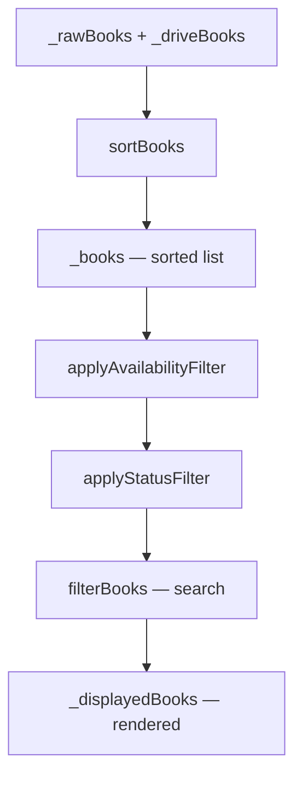

# Design Document — Library Availability Filter

## Overview

This feature adds an **Availability** filter to the AudioVault library screen. It lets users narrow their library to books playable without an internet connection ("Available offline") or to Drive books not yet downloaded ("Drive only"). The default state ("All") preserves existing behaviour.

The filter is surfaced in the existing filter sheet (alongside the PROGRESS section), persisted via `SharedPreferences`, and reflected in the view bar's active-filter indicator. It composes correctly with the existing status filter, search query, and sort order.

### Key design decisions

- **Pure filter function** — `applyAvailabilityFilter` is a top-level function (like the existing `applyStatusFilter` and `filterBooks`), making it independently testable without widget setup.
- **Enum stored as string name** — consistent with how `LibrarySortOrder` is persisted; avoids fragile integer indices.
- **Filter applied before status filter** — availability narrows the candidate set first; status filter then narrows further. This matches the requirement and is the natural reading order (availability → progress → search).
- **Pill counts computed from the availability-filtered list** — the PROGRESS pill counts already exclude books hidden by the availability filter, so the numbers stay consistent.
- **Drive-book conditional pills** — when no Drive books exist the "Available offline" and "Drive only" pills are hidden, keeping the UI uncluttered for local-only users.
- **Drive-connected gate** — the entire AVAILABILITY section is hidden when `DriveService.currentAccount == null`. The signal is read directly from the `DriveService` singleton via the service locator. If a non-`all` filter value was persisted from a previous session when Drive was connected, it is silently reset to `all` during `_initLibrary` when Drive is not connected.

---

## Architecture

The change is confined to three files:

```
lib/
  screens/library_screen.dart      ← enum, filter function, state, UI
  services/preferences_service.dart ← getAvailabilityFilter / setAvailabilityFilter
test/
  screens/library_helpers_test.dart ← applyAvailabilityFilter property tests
  services/preferences_service_test.dart ← round-trip tests
```

No new files, no new services, no new dependencies.



---

## Components and Interfaces

### `AvailabilityFilterState` enum

Defined at the top of `library_screen.dart`, alongside the existing `_ViewMode` and `LibrarySortOrder` enums.

```dart
enum AvailabilityFilterState {
  all,
  availableOffline,
  driveOnly;

  /// Human-readable label used in the view bar summary and filter pills.
  String get label => switch (this) {
    AvailabilityFilterState.all            => 'All',
    AvailabilityFilterState.availableOffline => 'Available offline',
    AvailabilityFilterState.driveOnly      => 'Drive only',
  };
}
```

### `applyAvailabilityFilter` — top-level pure function

```dart
/// Filters [books] by availability.
///
/// - [all]             → returns [books] unchanged.
/// - [availableOffline] → local books + Drive books with non-empty audioFiles.
/// - [driveOnly]       → Drive books with empty audioFiles only.
List<Audiobook> applyAvailabilityFilter(
  List<Audiobook> books,
  AvailabilityFilterState filter,
) {
  return switch (filter) {
    AvailabilityFilterState.all => books,
    AvailabilityFilterState.availableOffline => books.where((b) =>
        b.source == AudiobookSource.local ||
        (b.source == AudiobookSource.drive && b.audioFiles.isNotEmpty),
      ).toList(),
    AvailabilityFilterState.driveOnly => books.where((b) =>
        b.source == AudiobookSource.drive && b.audioFiles.isEmpty,
      ).toList(),
  };
}
```

### `_LibraryScreenState` — state additions

```dart
// New field
AvailabilityFilterState _availabilityFilter = AvailabilityFilterState.all;
```

`_displayedBooks` getter updated:

```dart
List<Audiobook> get _displayedBooks {
  final availFiltered = applyAvailabilityFilter(_books ?? [], _availabilityFilter);
  final searchFiltered = filterBooks(availFiltered, _searchQuery);
  return applyStatusFilter(searchFiltered, _statuses, _statusFilter);
}
```

`_initLibrary` updated to load the persisted value, with Drive-connected gate:

```dart
final availFilter = await prefs.getAvailabilityFilter();
final driveConnected = locator<DriveService>().currentAccount != null;
if (mounted) {
  setState(() {
    // Reset to `all` if Drive is not connected — the filter is meaningless
    // without a Drive account and the section won't be shown in the UI.
    _availabilityFilter = driveConnected ? availFilter : AvailabilityFilterState.all;
  });
}
```

### `PreferencesService` — new methods

```dart
static const _availabilityFilterKey = 'availability_filter';

Future<AvailabilityFilterState> getAvailabilityFilter() async {
  final name = (await _sp).getString(_availabilityFilterKey);
  return AvailabilityFilterState.values.firstWhere(
    (v) => v.name == name,
    orElse: () => AvailabilityFilterState.all,
  );
}

Future<void> setAvailabilityFilter(AvailabilityFilterState value) async {
  await (await _sp).setString(_availabilityFilterKey, value.name);
}
```

Note: `PreferencesService` lives in `lib/services/preferences_service.dart` and currently has no import of `library_screen.dart`. To avoid a circular dependency, `AvailabilityFilterState` must be importable from `preferences_service.dart`. The cleanest approach is to define the enum in a small separate file (`lib/models/availability_filter_state.dart`) imported by both, or to keep it in `library_screen.dart` and import `library_screen.dart` from `preferences_service.dart`. Given the project's existing pattern (e.g. `BookStatus` is defined in `audiobook.dart` and imported by `preferences_service.dart` indirectly via `position_service.dart`), the preferred approach is:

**Define `AvailabilityFilterState` in `lib/models/availability_filter_state.dart`** and import it in both `library_screen.dart` and `preferences_service.dart`. This keeps the dependency graph clean.

---

## Data Models

### `AvailabilityFilterState` (new model file)

```dart
// lib/models/availability_filter_state.dart
enum AvailabilityFilterState {
  all,
  availableOffline,
  driveOnly;

  String get label => switch (this) {
    AvailabilityFilterState.all             => 'All',
    AvailabilityFilterState.availableOffline => 'Available offline',
    AvailabilityFilterState.driveOnly       => 'Drive only',
  };
}
```

### Persistence key

| Key | Type | Default | Values |
|-----|------|---------|--------|
| `availability_filter` | `String` | `"all"` | `"all"`, `"availableOffline"`, `"driveOnly"` |

### Offline-availability classification

| Book type | `audioFiles` | Offline available? | Shown in `driveOnly`? |
|-----------|-------------|--------------------|-----------------------|
| Local | any | ✅ | ❌ |
| Drive | non-empty | ✅ | ❌ |
| Drive | empty | ❌ | ✅ |

---

## Correctness Properties

*A property is a characteristic or behavior that should hold true across all valid executions of a system — essentially, a formal statement about what the system should do. Properties serve as the bridge between human-readable specifications and machine-verifiable correctness guarantees.*

### Property 1: `all` filter is identity

*For any* list of audiobooks, applying `applyAvailabilityFilter` with `AvailabilityFilterState.all` shall return a list containing exactly the same books in the same order.

**Validates: Requirements 2.1**

---

### Property 2: `availableOffline` filter returns only offline-available books

*For any* list of audiobooks, every book returned by `applyAvailabilityFilter` with `availableOffline` shall be either a local book or a Drive book with a non-empty `audioFiles` list; and every book in the input that satisfies this condition shall appear in the output.

**Validates: Requirements 2.2**

---

### Property 3: `driveOnly` filter returns only undownloaded Drive books

*For any* list of audiobooks, every book returned by `applyAvailabilityFilter` with `driveOnly` shall be a Drive book with an empty `audioFiles` list; and every book in the input that satisfies this condition shall appear in the output.

**Validates: Requirements 2.3**

---

### Property 4: Availability filter preserves sort order

*For any* sorted list of audiobooks and any `AvailabilityFilterState`, the relative order of books in the output of `applyAvailabilityFilter` shall be the same as their relative order in the input.

**Validates: Requirements 2.5**

---

### Property 5: Availability filter composes correctly with status filter

*For any* list of audiobooks, any `AvailabilityFilterState`, and any `BookStatus` filter, applying `applyAvailabilityFilter` then `applyStatusFilter` shall produce a result that is a subset of applying `applyAvailabilityFilter` alone, and every book in the result shall satisfy both filter predicates independently.

**Validates: Requirements 2.4**

---

### Property 6: Pill counts match actual filtered counts

*For any* list of audiobooks, the count displayed in each availability pill (All, Available offline, Drive only) shall equal the length of the list returned by `applyAvailabilityFilter` for the corresponding state.

**Validates: Requirements 3.2**

---

### Property 7: Drive-book pill visibility

*For any* list of audiobooks, the "Available offline" and "Drive only" pills shall be visible if and only if at least one book in the list has `source == AudiobookSource.drive`.

**Validates: Requirements 3.4**

---

### Property 8: Preferences round-trip

*For any* `AvailabilityFilterState` value, calling `setAvailabilityFilter(v)` followed by `getAvailabilityFilter()` shall return `v`.

**Validates: Requirements 5.2**

---

**Property reflection — redundancy check:**

- Properties 2 and 3 are complementary, not redundant: they cover different filter states with different predicates.
- Property 1 (identity) is not subsumed by 2 or 3 — it specifically validates the `all` pass-through path.
- Property 4 (sort preservation) is independent of 1–3; it tests a structural invariant of the output, not its membership.
- Property 5 (composition) is independent — it tests the interaction between two separate filter functions.
- Property 6 (pill counts) tests the UI count computation, not the filter function itself.
- Property 7 (pill visibility) tests a conditional display rule, not the filter function.
- Property 8 (prefs round-trip) tests persistence, not filtering.

All 8 properties are retained; none are redundant.

---

## Error Handling

| Scenario | Handling |
|----------|----------|
| Persisted filter value is unrecognised (e.g. from a future version downgrade) | `getAvailabilityFilter` falls back to `AvailabilityFilterState.all` via `firstWhere(orElse:)` |
| `_books` is null during filter computation | `_displayedBooks` guards with `_books ?? []` — returns empty list |
| Drive download event arrives after widget is disposed | Existing `_driveSub` cancel in `dispose()` prevents stale callbacks |
| Availability filter active when all Drive books are removed (e.g. Drive disconnected) | `_driveBooks` becomes empty; `applyAvailabilityFilter` returns empty list; no-matches view shown with "Clear filters" button |
| Drive not connected on app launch but a non-`all` filter was persisted from a previous session | `_initLibrary` detects `DriveService.currentAccount == null` and resets `_availabilityFilter` to `all` before first render; AVAILABILITY section is not shown |

---

## Testing Strategy

### Unit tests — `applyAvailabilityFilter` (added to `test/screens/library_helpers_test.dart`)

These cover the pure filter function with concrete examples and edge cases:

- `all` returns input unchanged (empty list, mixed list)
- `availableOffline` includes local books
- `availableOffline` includes Drive books with non-empty `audioFiles`
- `availableOffline` excludes Drive books with empty `audioFiles`
- `driveOnly` includes only Drive books with empty `audioFiles`
- `driveOnly` excludes local books
- `driveOnly` excludes downloaded Drive books
- Empty input returns empty output for all three states

### Unit tests — `PreferencesService` (added to `test/services/preferences_service_test.dart`)

- `getAvailabilityFilter` defaults to `all` when unset
- Round-trip for each of the three enum values

### Property-based tests — `applyAvailabilityFilter` (added to `test/screens/library_helpers_test.dart`)

Property-based testing library: **`package:fast_check`** (Dart port of fast-check; pure Dart, no platform dependencies, suitable for unit tests).

Each property test runs a minimum of **100 iterations**.

Tag format: `// Feature: library-availability-filter, Property N: <property text>`

| Property | Test description |
|----------|-----------------|
| P1 | For any book list, `all` filter returns identical list |
| P2 | For any book list, every `availableOffline` result satisfies the predicate, and every qualifying input book is included |
| P3 | For any book list, every `driveOnly` result satisfies the predicate, and every qualifying input book is included |
| P4 | For any book list and filter state, relative order of output books matches input |
| P5 | For any book list, availability + status composition produces a subset satisfying both predicates |
| P6 | For any book list, pill counts equal `applyAvailabilityFilter(...).length` for each state |
| P7 | For any book list, drive pills visible iff at least one drive book exists |
| P8 | For any `AvailabilityFilterState`, prefs round-trip returns the same value |

### Integration / widget tests

The reactive UI behaviours (requirements 2.6, 2.7, 5.3) are covered by widget tests in `test/screens/library_scan_test.dart` or a new `test/screens/library_availability_filter_test.dart`, using `MockPreferencesService` and simulated `DriveDownloadEvent` streams.
